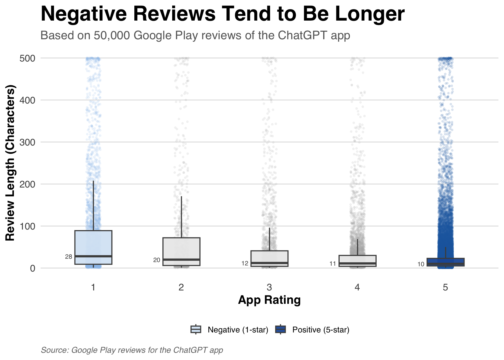

# Анализ отзывов пользователей ChatGPT

Этот проект исследует связь между пользовательскими оценками и длиной отзывов в Google Play для приложения ChatGPT.

## Датасет

Датасет содержит 50 000 отзывов из Google Play, включая:
- оценки пользователей
- текст отзывов
- метаданные отзывов

## Цели проекта

Цель проекта:
- исследовать различия в длине отзывов между разными оценками приложения
- провести статистический анализ

## Основной вывод

Пользователи, оставляющие низкие оценки, как правило, пишут более длинные отзывы.

Медианная длина отзывов уменьшается:
- с 28 символов для отзывов с оценкой 1
- до 10 символов для отзывов с оценкой 5.

## Файлы проекта

- `good_project.R` — скрипт финальной визуализации
- `reviews.csv` — датасет
- `good_graph_final.png` — финальный график проекта

## Использованные инструменты

- R
- ggplot2
- tidyverse

## Финальный график

## Автор

Марина Ашуркина